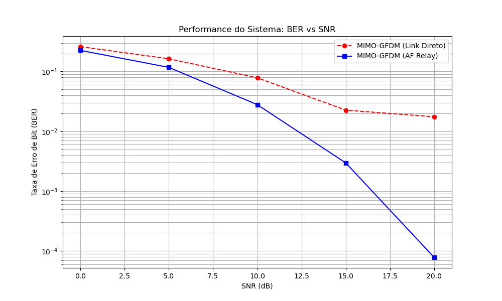
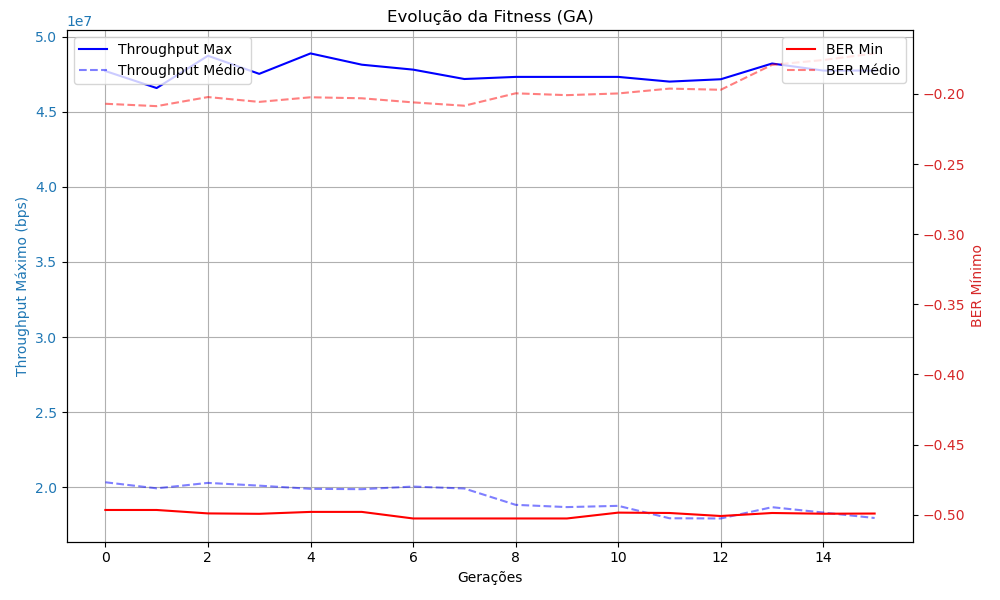
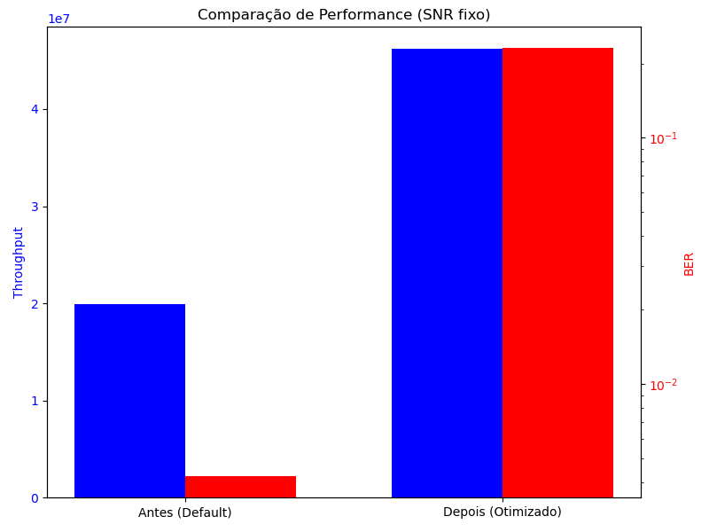

# 📡 Simulação 5G NR: MIMO-GFDM com AF Relay e Inteligência Evolutiva

Este repositório contém um simulador robusto da camada física (PHY) voltado para tecnologias candidatas e aplicadas no ecossistema de redes móveis **5G NR** e além. O projeto foca em avaliar o ganho de eficiência espectral e mitigação de erros através do uso de comunicação cooperativa e algoritmos genéticos.

---

## ✨ Principais Características

- **MIMO (Multiple-Input Multiple-Output)**: Processamento e modulação com múltiplas antenas (2x2), com suporte para esquemas até 64-QAM.
- **Forma de Onda GFDM**: Modulação *Generalized Frequency Division Multiplexing*, implementada com filtros Root-Raised Cosine para reduzir emissões fora de banda (OOBE).
- **Comunicação Cooperativa (AF Relay)**: Modelagem de uma antena repetidora no modo *Amplify-and-Forward* para combater o desvanecimento de Rayleigh.
- **Equalização Avançada (MMSE)**: Filtro dinâmico para anular a interferência cruzada do MIMO sem causar amplificação catastrófica do ruído.
- **Otimização via Machine Learning**: Utilização de Algoritmo Genético (NSGA-II) para calibração simultânea de múltiplos objetivos: maximização de Throughput (Vazão) e minimização do BER (Taxa de Erro de Bit).

---

## ⚙️ Pré-requisitos e Instalação

O projeto foi construído sobre Python 3.10+ e foca fortemente em operações matriciais otimizadas em CPU. 

### 1. Clonando ou Acessando o Repositório
Navegue até a pasta do projeto no seu terminal:
```bash
cd /caminho/para/simulation_py
```

### 2. Configurando o Ambiente Virtual (Recomendado)
A melhor prática para executar este projeto isoladamente é criar um ambiente virtual (`venv`):
```bash
# Cria o ambiente virtual na pasta venv/
python -m venv venv

# Ativa o ambiente virtual (Linux / macOS)
source venv/bin/activate
# Ativa o ambiente virtual (Windows)
# venv\Scripts\activate
```

### 3. Instalando Dependências
Com o ambiente ativado, instale os pacotes base de dados e plotagem:
```bash
pip install numpy scipy matplotlib deap
```
*(Caso esteja utilizando um ambiente global no Linux protegido pelo PEP-668, adicione a flag `--break-system-packages` caso saiba o que está fazendo).*

---

## 🚀 Como Executar

A execução principal do projeto abstrai as simulações e orquestra automaticamente os comparativos base (Sem IA) versus otimizados (Com IA).

Para iniciar a simulação, simplesmente rode o maestro do projeto:

```bash
python main.py
```

**Durante a execução, o terminal exibirá:**
1. A varredura (Sweep) de SNR de 0dB a 20dB.
2. A evolução geracional da Inteligência Artificial em tempo real.
3. Os parâmetros vencedores descobertos pela máquina.
4. As taxas exatas de *Throughput* de ganho.

---

## 📊 Resultados e Saídas Gráficas

A execução gera automaticamente **3 relatórios gráficos em alta qualidade** salvos na raiz do seu projeto:

- `ber_vs_snr.png`: Gráfico *Waterfall* logarítmico provando o ganho da antena Relay contra o desvanecimento do link direto.
  
  <p align="center">
    
  </p>

- `fitness_evolution.png`: Gráfico temporal exibindo as tentativas da IA, a estabilização do ganho de internet (eixo Y1) e a queda do ruído (eixo Y2).

  <p align="center">
    
  </p>

- `comparison.png`: Gráfico de barras atestando a diferença de Vazão e Erro (O *Trade-Off* matemático) após a aplicação dos resultados da inteligência artificial.

  <p align="center">
    
  </p>

---

## 📁 Estrutura do Projeto e Documentação

O código foi rigorosamente componentizado seguindo o paradigma de engenharia de software sustentável. Para manter o código limpo, **todos os comentários teóricos, fórmulas e explicações foram movidos para a pasta `/docs/`**.

### Diretório `docs/`
Para entender profundamente a matemática e as equações presentes no código, visite a documentação modular:

- 📄 [`docs/channel.md`](docs/channel.md) - Modelagem da física e ruído (Rayleigh/AWGN).
- 📄 [`docs/relay.md`](docs/relay.md) - Dinâmica de Amplificação da antena cooperativa.
- 📄 [`docs/mimo.md`](docs/mimo.md) - Transmissores, Receptores e Equalizador MMSE.
- 📄 [`docs/gfdm.md`](docs/gfdm.md) - Matemática da modulação matricial paralela GFDM.
- 📄 [`docs/optimization.md`](docs/optimization.md) - Algoritmo Genético do pacote DEAP.
- 📄 [`docs/simulation.md`](docs/simulation.md) - Orquestrador de blocos do Monte Carlo.
- 📄 [`docs/graficos.md`](docs/graficos.md) - Como ler cientificamente os gráficos gerados.

---
*Projeto voltado para simulação técnica de PHY-Layer de redes móveis (IEEE).*
